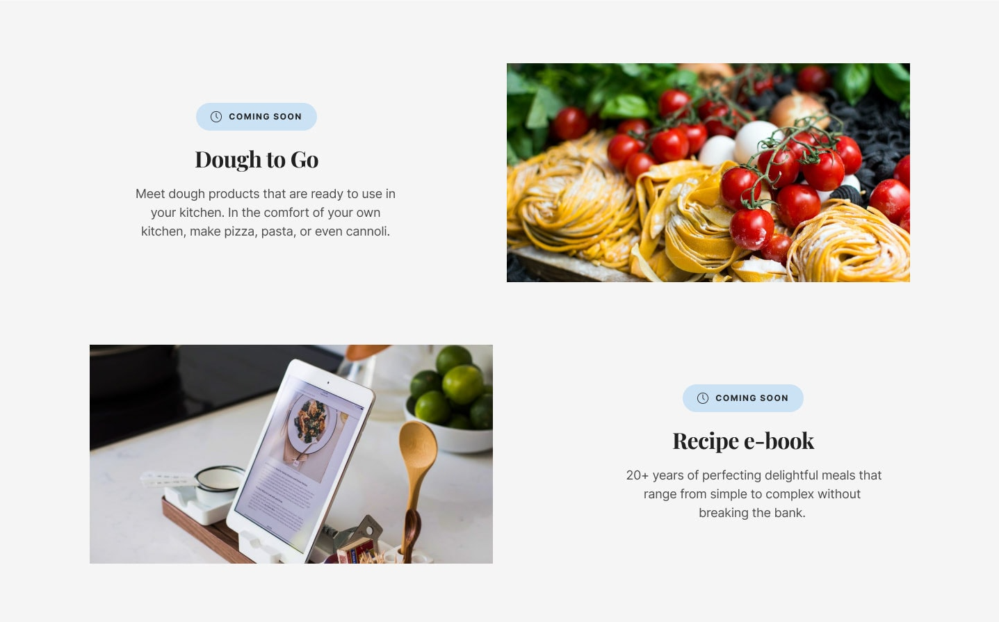
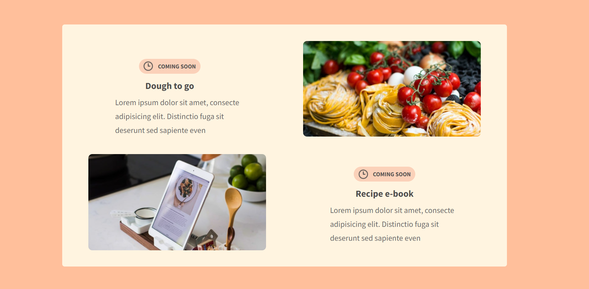

# restaurant-slide
<strong>A simple restaurant slide made with HTML &amp; CSS</strong>

## Table of contents
  - [Screenshot](#screenshot)
  - [Links](#links)
  - [Built with](#built-with)
  
### Screenshot
 <strong>Tried to clone this slide</strong>
 
  
  
 <strong>This is the End Result</strong>
 

### Links

- Solution URL: [Here](https://github.com/nehanawar025/restaurant-slide)
- Live Site URL: [Live Demo](https://nehanawar025.github.io/restaurant-slide/)

### Built with

- Semantic HTML5 markup
- CSS &
- Love :heart:

